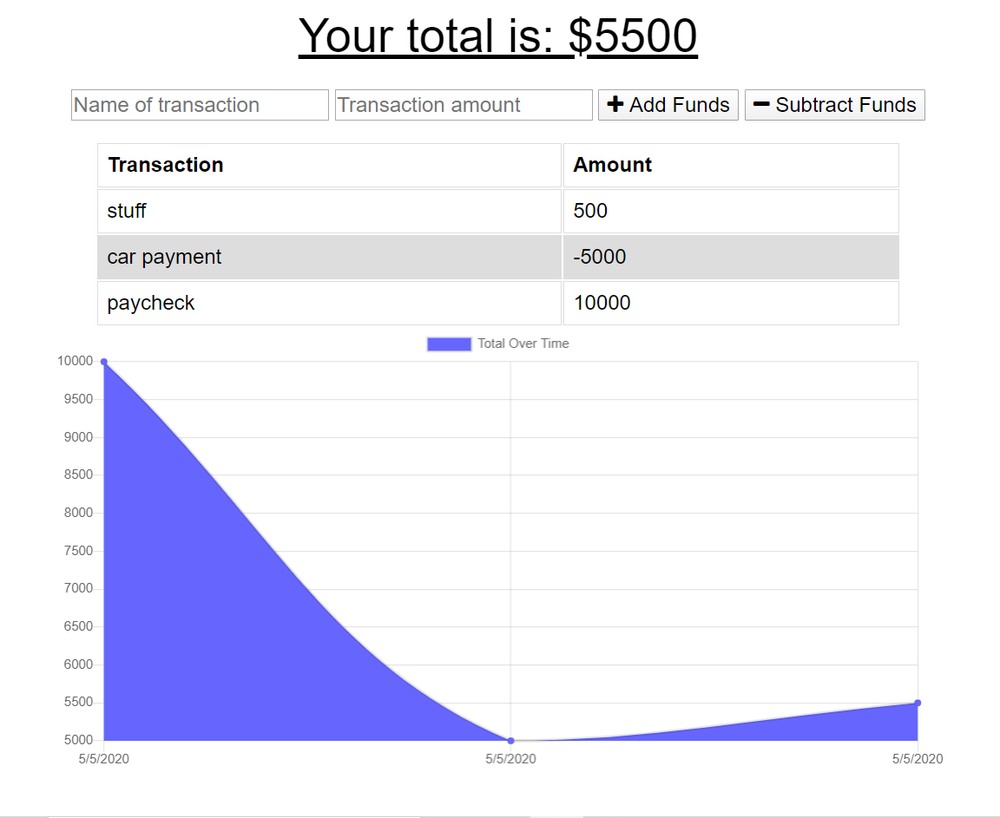

 ## Project Name
> budget-tracker

## Table of contents
* [General info](#general-info)
* [Screenshots](#screenshots)
* [Setup](#setup)
* [Status](#status)
* [Contact](#contact)

## General info
This is a program designed using javascript that allows a user to keep track of their budget/daily expenditures by storing their expenses/paychecks in a database. This application shows the user a visual representation of their spending patterns via a rendered graph. 
## Screenshots



## Setup
This program runs in browser. If you want to download the Progessive Web App (PWA), you can download it from the top right hand corner of the webpage. This webpage has offline functionality.

## Code Examples
Show examples of usage:
```
 self.addEventListener("install", (evt) => {
    evt.waitUntil(
      caches.open(CACHE_NAME).then((cache) => {
        console.log("Your files were pre-cached successfully!");
        // adds everyting from created cache to files_to_cache
        return cache.addAll(FILES_TO_CACHE);
      })
    );
  
    self.skipWaiting();
  });
  
  self.addEventListener("activate", (evt) => {
    evt.waitUntil(
      caches.keys().then((keyList) => {
        return Promise.all(
          keyList.map((key) => {
            if (key !== CACHE_NAME && key !== DATA_CACHE_NAME) {
              console.log("Removing old cache data", key);
              return caches.delete(key);
            }
          })
        );
      })
    );
  
    self.clients.claim();
  });
```
This is a service worker that allows the user to cache files and essentially have full funtionality of the webpage while offline.

## Status
Project is finished. Feel free to email me with any suggestions or to report any bugs: ianmharris93@gmail.com


## Contact
Created by Ian Harris(https://github.com/iannm93) - ianmharris93@gmail.com - feel free to contact me!
